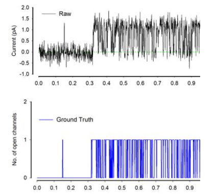

# Ion-Switching
 University of Liverpool -Ion Switching(R Programming)
-------------------------------
Project Descriptin
-------------------------------

Think you can use your data science skills to make big predictions at a submicroscopic level?

Many diseases, including cancer, are believed to have a contributing factor in common. Ion channels are pore-forming proteins present in animals and plants. They encode learning and memory, help fight infections, enable pain signals, and stimulate muscle contraction. If scientists could better study ion channels, which may be possible with the aid of machine learning, it could have a far-reaching impact.

When ion channels open, they pass electric currents. Existing methods of detecting these state changes are slow and laborious. Humans must supervise the analysis, which imparts considerable bias, in addition to being tedious. These difficulties limit the volume of ion channel current analysis that can be used in research. Scientists hope that technology could enable rapid automatic detection of ion channel current events in raw data.

The University of Liverpool’s Institute of Ageing and Chronic Disease is working to advance ion channel research. Their team of scientists have asked for your help. In this competition, you’ll use ion channel data to better model automatic identification methods. If successful, you’ll be able to detect individual ion channel events in noisy raw signals. The data is simulated and injected with real world noise to emulate what scientists observe in laboratory experiments.

Technology to analyze electrical data in cells has not changed significantly over the past 20 years. If we better understand ion channel activity, the research could impact many areas related to cell health and migration. From human diseases to how climate change affects plants, faster detection of ion channels could greatly accelerate solutions to major world problems.

Acknowledgements:
This would not be possible without the help of the Biotechnology and Biological Sciences Research Council (BBSRC).
----------------------
INTRODUCTION
----------------------
A single ion channel is a pore in the cell membrane that can assume an “open” state in which ions (such as potassium or sodium) can pass through. Ion channels are “gated”, i.e. they open in response to a specific stimulus, such as a change in membrane potential (voltage-gated ion channels) or the binding of a neurotransmitter (ligand-gated ion channels). Ion channels are present in the membranes of all excitable cells. Their functions include establishing a resting membrane potential, shaping action potentials and other electrical signals by gating the flow of ions across the cell membrane, controlling the flow of ions across secretory and epithelial cells, and regulating cell volume.

When ion channels open, they pass electric currents. Existing methods of detecting these state changes are slow and laborious. Humans must supervise the analysis, which imparts considerable bias, in addition to being tedious. These difficulties limit the volume of ion channel current analysis that can be used in research.

The task is to create a model to predict the number of open channels based on electrophysiological signal data, at each timestamp.

Overview of the data: 

The data was recorded in the batches of 50 seconds. Therefore, each 500,000 rows are in one batch. The training data has 10 batches, total 5,000,000 and the test data has 4 batches, total 2,000,000 records.

I have used the cleaned data, i.e. data without the drift.

Link for the cleaned data: https://www.kaggle.com/cdeotte/data-without-drift

Loading required packages and Librarieshttps://github.com/akuma190/Ion-Switching/blob/master/README.md 
library(data.table) 
library(dplyr) 
library(ggplot2) 
library('scales')  
library('grid')  
library('gridExtra')  
library('RColorBrewer')  
library('corrplot') 
library('ggridges') 
library(caTools) 
library(randomForest) 
library(glmnet) 
library(tidyverse) 
library(caret) 
library(rpart) 

setwd("/Users/jasneekchugh/Desktop/DataScience/R-Programming/Ion-Switching") 

reading the required files 
trainData <- fread('data/train_clean.csv', sep = ",", header=T) 
testData<- fread('data/test_clean.csv', sep = ",", header=T) 
sampleSubmission<- fread('data/sample_submission.csv', sep = ",", header=T) 

#summary of the data 
#The data was recorded in batches of 50 seconds. Therefore, there are 500,000 rows per batch. 
str(trainData) 
Classes ‘data.table’ and 'data.frame':	5000000 obs. of  3 variables: 
 $ time         : num  1e-04 2e-04 3e-04 4e-04 5e-04 6e-04 7e-04 8e-04 9e-04 1e-03 ... 
 $ signal       : num  -2.76 -2.85 -2.42 -3.13 -3.14 ... 
 $ open_channels: int  0 0 0 0 0 0 0 0 0 0 ... 
 - attr(*, ".internal.selfref")=<externalptr>  

head(trainData)#Train data has 10 batches 

dim(trainData)  
[1] 5000000       3 

table(trainData$open_channels) #0-10, 11 levels. Prediction will 11 possible values.  
#Time- 50 seconds long 10khz sample( 500,000 rows per batch) meaning we have 10 batches. 
#The data is continuous within the batches, but discontinuous between the batches. 

head(testData) #Test data has 4 batches 

dim(testData)#2000000, 2 
[1] 2000000       2 

#reformatting 
trainData <- trainData %>%  
+   mutate(open_channels = factor(open_channels)) %>% 
+   mutate(signal= as.numeric(signal)) 

Data Visualizations 

ggplot(data=trainData)+geom_bar(aes(x=open_channels, fill= open_channels)) 

#Time VS Signal 
#Train Data 
ggplot(data=trainData)+geom_line(aes(x=time,y=signal, color="#56B4E9")) 

#Test Data 
ggplot(data=testData)+geom_line(aes(x=time,y=signal, color="#000099")) 

trainData %>% sample_n(10000) %>% 
+ ggplot(aes(x = time, y = signal))+ 
+ geom_line(color = "black", alpha = 0.7)+ 
+ geom_vline(xintercept = seq(0, 500, 50),size = 1.5, alpha = 0.7, color = "red") 

ggplot(trainData,aes(x=open_channels,y=signal,fill=open_channels))+ geom_boxplot()+ 
labs(title="Signal per number of open channels", x="Open Channel", y="Signal", 
colour="open_channels") + scale_x_discrete(limits=as.character(0:10)) 

#Dividing the Train data into batches 
trainData$batch<- as.factor((trainData$time - 0.0001)%/%50) 
trainData$time_batch <- ((trainData$time - 0.0001)%%50)+0.0001 
#Visualizing Number of Open Channels in Each Batch 
trainData %>% count(batch, open_channels) %>% rename(Number_of_Open_Channels = n) 
%>% ggplot(aes(x = as.character(open_channels), y = Number_of_Open_Channels, 
 fill = as.character(open_channels)))+ 
 geom_bar(stat = "identity", alpha = 0.7)+ 
 facet_wrap(~batch)+theme(legend.position = "none")+ 
 labs(title = "Number of open channels in each batch", x = "Open Channels") 
 

 
 MODEL IMPLEMENTATION: 
We have used Random Forest model to predict the Open Channels. We have used it with 
10% bagging of data. We choose to use Random Forest model because the data set was very 
heavy and it was unbalanced. The Random Forest model has fast training speed and quick 
prediction capability and can handle unbalanced data as it tries to minimize the overall error 
rate. 
As model creation and prediction was done separately please refer to the attached R file 

“Final.R” for code. 
start_time <- Sys.time() 
suppressMessages(library(randomForest)) 
suppressMessages(library(glmnet)) 
suppressMessages(library(tidyverse)) 
suppressMessages(library(caret)) 
suppressMessages(library(dplyr)) 
suppressMessages(library(rpart)) 
library(e1071) 
#here we are reading the data to train 
train<-read.csv("train (1).csv") 
#here we are reading the data to test 
test<-read.csv("test (1).csv") 
test<-test[,c(1,2)] 
#we are taking the samples fomr the total training data. 
x<-train[sample(nrow(train))[c(1:200000)],c(2,3)] 
x_train<-x[sample(0.8*nrow(x)),c(1,2)] 
x_train[,2]<-as.factor(x_train[,2]) 
x_val<-x[-sample(0.8*nrow(x)),c(1,2)] 
x_val[,2]<-as.factor(x_val[,2]) 
t<-as.data.frame(x_val[,-2]) 
colnames(t)<-'signal' 
#we are building the model using the random forest 
model<-randomForest(open_channels~.,data =x_train,importance = TRUE) 
pred<-predict(model,newdata=t,type="response") 
#creating the confusion matrix and storing it in the result 
result<-confusionMatrix(pred,x_val[,2])[4] 
mean(result$byClass[,11])#val_accuracy: 
#rm(list=ls()) 
preds = data.frame(c(11:2000010)) 
n= 40 
#we are training the data with 40 samples. 
for (i in 1:n){ 

 x<-train[sample(nrow(train))[c(1:100000)],c(2,3)] 
 x_train<-x[sample(0.8*nrow(x)),c(1,2)] 
 x_train[,2]<-as.factor(x_train[,2]) 
 model<-randomForest(open_channels~.,data =x_train,importance = TRUE) 
 pred<-predict(model,newdata=subset(test),type="response") 
 preds <-cbind(preds,pred) 

} 
colnames(preds)<-c(0:n) 
preds<-preds[,c(2:n)] 
head(preds) 
#creating a CSV from the prediction data. 
write.csv(preds,'Group_7_submission.csv',row.names = FALSE,quote = FALSE) 
test<-test[,1] 
y_final = read.csv("Group_7_submission.csv") 
y_final<-apply(y_final, 1,median) 
df<-data.frame(cbind(test,y_final)) 
colnames(df)<-c("time","open_channels") 
write.csv(df,'Group_7_submission.csv',row.names = FALSE,quote = FALSE) 
#hist(df$open_channels) 
end_time <- Sys.time() 
end_time - start_time 
rm(list=ls()) 

KAGGLE SCREENSHOT: 

